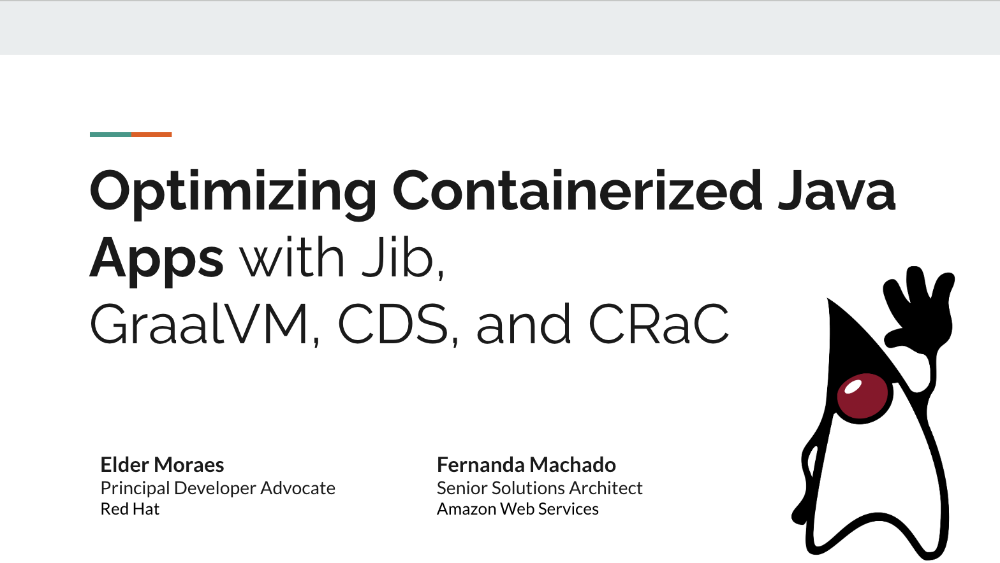

This repository contains the shell scripts used for the demonstrations of the following presentation at the [Devnexus 2025](https://devnexus.com/presentations/optimizing-containerized-java-apps-with-jib-graalvm-cds-and-crac) conference.

You can download the slide deck [here](https://s12d.com/devnexus-2025-slide-deck). 
